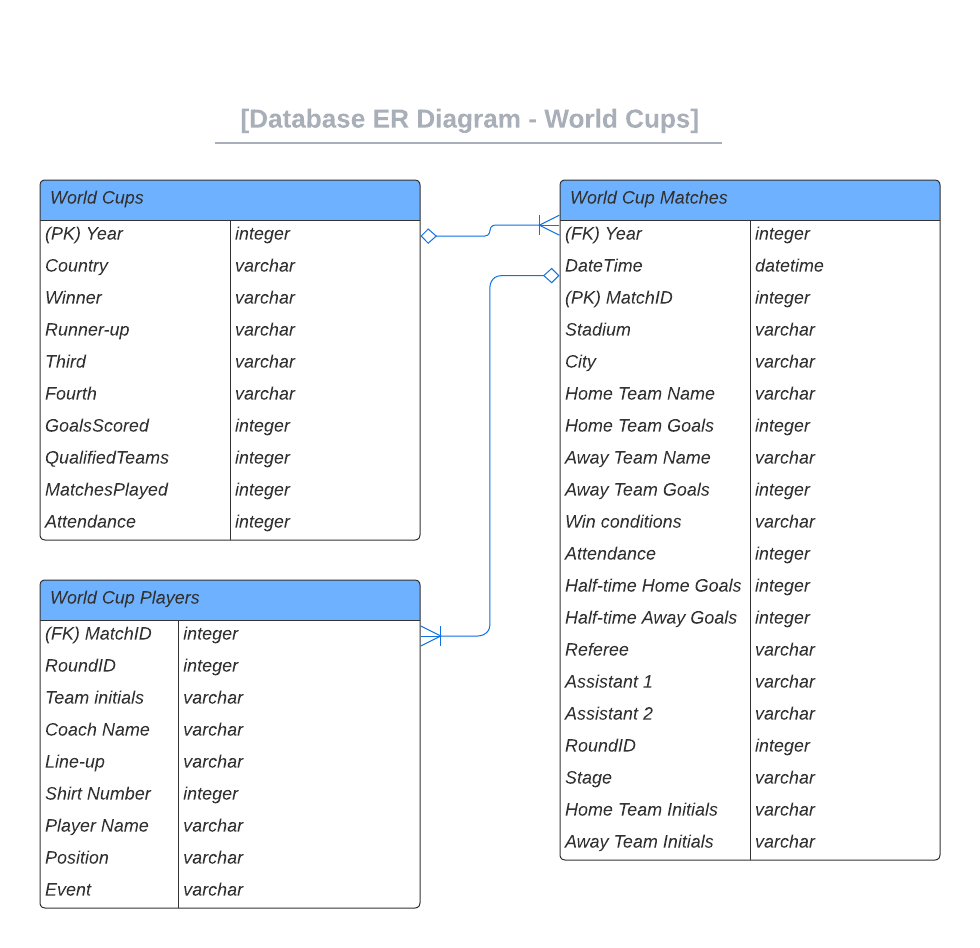

## Running Streamlit, Postgres and Adminer with docker-compose

The project takes data from the different World Cups to create and populate a database, which will then be queried and analyzed by creating a Streamlit app.

### <ins> World Cups' dataset description

This database gathers information available on the FIFA World Cup Archive website about the history of the competition.

World Cups from 1930 to 2014 are included.
        
[Source](https://www.kaggle.com/datasets/abecklas/fifa-world-cup) 

### <ins>Tables</ins>:
* World Cups 🏆 
* Matches ⚽
* Players 🏃‍♂️   

### <ins>Tables' details</ins>:
* #### World Cups: 
Lists all World Cups between 1930-2014. Includes information about the host and the participants that ended in the first four positions of the tournament.

It also gives the total amount of goals, teams, matches and attendance per edition. 

* #### Matches:

The most detailed table of the diagram. Includes data about each match of every round in all editions.

It provides dates, cities, stadiums, final results, partial results per half, referees and assistant names.

* #### Players:   

Holds players' details. Names, line-ups to show which ones started on the field, and which were in the bench by the beginning of the match.

We can also find all events per player:

    * G = Goal 
    * OG = Own Goal 
    * Y = Yellow Card 
    * R = Red Card
    * SY = Red Card by second yellow
    * P = Penalty
    * MP = Missed Penalty
    * I = Substitution In
    * O = Substitution Out

### <ins>ER Diagram</ins>:

### <ins>Main analysis points</ins>:

* Which national team has participated in more editions?
* Which national team has won more matches historically?
* Which players are the all-time scorers?
* Are most goals scored in the first or in the second half?
* Which were the dirtiest matches (yellow and red cards)?
* Which host has the biggest attendance?
* In which round/group are most goals scored?
* World Cup Champions - summary  

### <ins> Create project </ins>:

Simply run the command `docker-compose up -d --build `

Once the containers are up, results will be available [here](http://localhost:8501)

